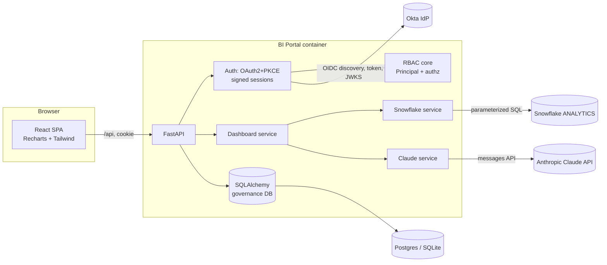
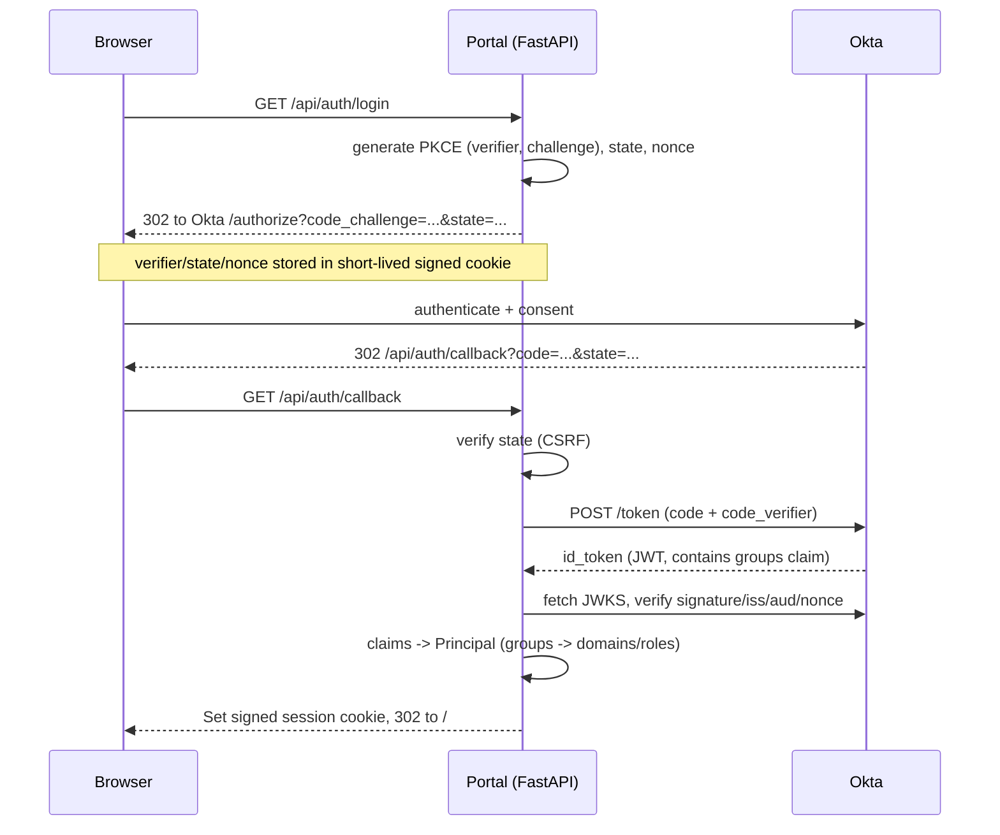
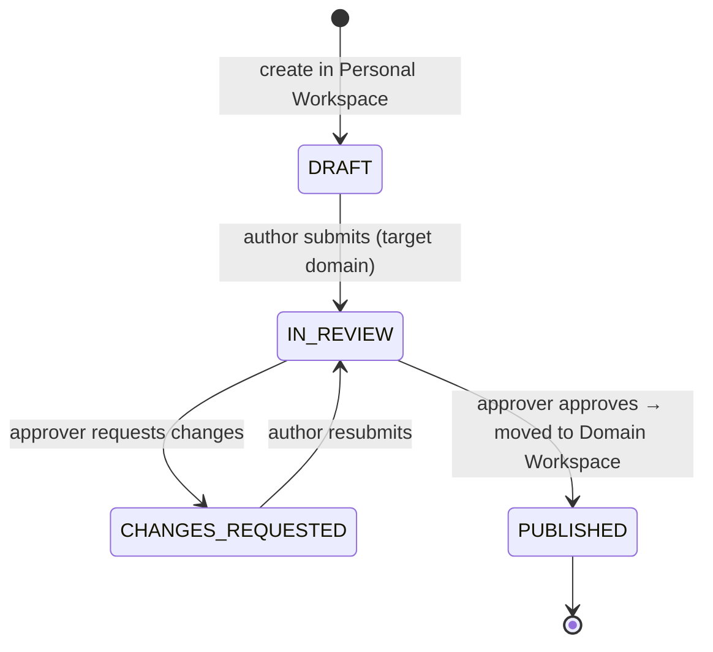
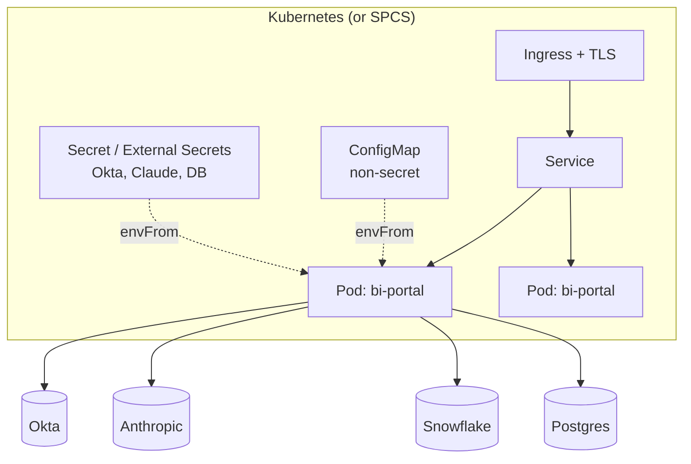

<!-- _class: title-slide -->
<!-- _paginate: false -->

# Centralized BI Portal
## Governed, AI-native dashboards for every business function

Your name · AI Data Platform & Engineering · date

*Okta OAuth2 + PKCE · Centralized RBAC · Claude-powered insights · Single-container deploy*

<!-- 
SPEAKER NOTE:
I'll walk through the architecture, the AI integration, the security model, and the data model — and show all of it running live. Everything you see is real, working code.

VISUAL: screenshot of the portal — chart + AI insight panel side by side.
-->

---

# The Problem

- Every business function (Finance, Sales Ops, RevOps) needs dashboards — but can't build them
- The data team becomes the **permanent bottleneck**: every ask is a ticket, every ticket is a delay
- The unsafe workaround: one-off exports, emailed spreadsheets — **no governance, no trust, no audit trail**
- The challenge: give teams **self-serve access** without losing the access controls and review gates the data platform team needs

<!-- 
SPEAKER NOTE (Head of Eng / Data Platform Eng):
The real cost isn't the tickets — it's that the data team can't work on the high-value platform work because they're pulling ARR cuts. This is an engineering problem: how do you build self-serve in a way you'd trust to put real data behind?

VISUAL: simple "before" diagram — stakeholders → ticket queue → overloaded data team.
-->

---

# What We Built (scope on one slide)

Five pillars, each fully implemented:

1. **Portal shell** — Shared, Domain (per business function), and Personal workspaces
2. **Auth** — Okta OAuth2 Authorization Code + PKCE, with a zero-dependency mock fallback
3. **RBAC** — centralized, server-side, tested in isolation; enforced at every API layer
4. **Governed publishing** — Draft → In Review → Published state machine with explicit audit records
5. **Two Claude dashboards** — ARR Waterfall (Finance) + Pipeline Health (Sales Ops); chart + grounded AI insight
6. **Deployable** — single Docker image → Kubernetes or Snowflake Container Services

<!-- 
SPEAKER NOTE:
Depth over breadth. Two dashboards done properly with a real security and governance foundation underneath — rather than five dashboards with none.

VISUAL: 6 tiles, one per pillar.
-->

---

# Architecture

- **One container** — FastAPI serves both the API and the built React SPA. Same origin in production: no CORS, no token forwarding.
- **Pluggable externals** — Okta, Snowflake, Anthropic/Claude, Postgres/SQLite — each has a graceful fallback with identical code paths.
- **Stateless app tier** — signed-cookie sessions (itsdangerous). No shared session store needed → horizontal scaling.



<!-- 
SPEAKER NOTE (Data Platform Eng):
The pluggable fallback design is load-bearing for both demo and ops. No Okta tenant? Mock auth. No Snowflake creds? Synthetic data of the same shape. No Claude key? Deterministic insight generator. Prod and demo differ only by env vars — the thing you demo is the thing you ship.
-->

---

# Live Demo (~4 min)

1. Log in as **Frank (Finance analyst)** → sees Finance + Shared folders; Sales Ops is absent
2. Open **ARR Waterfall** → chart loads, Claude insight panel appears alongside it
3. Try to open a **Sales Ops dashboard by direct URL** → **404** — not a hidden button, the API genuinely doesn't return the data
4. As Frank, create a draft in **Personal Workspace** → submit for review
5. Switch to **Fiona (Finance Approver)** → **Approvals** tab → approve → report moves to the Finance domain folder

> The 404 on the direct URL is the moment to dwell on — that's not a frontend trick, that's the API enforcing access before touching the database. I'll show the test that proves it.

<!-- 
SPEAKER NOTE:
VISUAL: the running app. Fallback = annotated screenshots.
-->

---

# Security: Okta OAuth2 + PKCE

- **Authorization Code + PKCE** (OAuth 2.1) — no implicit flow, no client secret in the browser
- `state` parameter: CSRF protection on the redirect
- `nonce` claim: replay protection — binds the `id_token` to this specific login attempt
- JWKS signature verification: `iss`, `aud`, `nonce`, `RS256` — we verify, not just decode
- Group memberships arrive in the `groups` claim of the `id_token` → only input to RBAC
- Mock fallback mints the exact same session structure — same downstream code path



<!-- 
SPEAKER NOTE (Head of Eng / AI Eng):
PKCE binds the token exchange to the browser that started the flow — an intercepted authorization code is useless without the verifier. The mock mode isn't a shortcut; it sets the same signed cookie with the same claims structure so every RBAC test runs against real logic.
-->

---

# RBAC: How It Actually Works

- Group string → `(domain, role)` mapping lives in **exactly one file** (`auth/rbac.py`). No router ever parses a group string.
- **Two enforcement layers** — defense in depth: point checks + query scoping
- Cross-domain access returns **404, not 403** — the API does not confirm the resource exists

| Okta group | Domain | Role |
|---|---|---|
| `BI-Portal-Admin` | all | admin |
| `BI-Finance` | finance | author |
| `BI-Finance-Approver` | finance | approver |
| `BI-SalesOps` | sales_ops | author |
| `BI-SalesOps-Approver` | sales_ops | approver |
| `BI-RevOps` | revops | author |
| `BI-CustomerSuccess` | customer_success | author |

```
HTTP request
  → get_current_principal()       # 401 if no/invalid session
  → get_current_user()            # resolve DB user (JIT provisioned)
  → authz.* check on the resource # 404/403 if not entitled
  → query scoping (visible_*)     # list endpoints can't over-return
  → handler runs
  → audit() security-relevant actions
```

<!-- 
SPEAKER NOTE (Head of Eng):
The two-layer design means a single bug in a handler can't leak data — the query was already pre-filtered. A security reviewer reads two files to understand the entire policy. And the policy has unit tests that don't touch HTTP at all.
-->

---

# Governed Publishing Workflow

- Reports are born in a **Personal Workspace** (private to the author)
- Author submits → status moves to **In Review**; a domain approver reviews
- Approver approves → report moves to the **Domain folder** (visible to all domain members)
- Rejects → **Changes Requested** (back to the author)
- Every submission and decision is an **explicit `ApprovalRequest` row** — not a boolean flag



<!-- 
SPEAKER NOTE (BI Leads / Data Platform Eng):
This is how you make self-serve safe — nothing reaches a domain folder without a review gate. The ApprovalRequest table is append-only, so you always know who approved what and when. That's the audit evidence a BI governance programme needs.
-->

---

# The Claude Dashboards: Engineering the AI Layer

| Dashboard | Stakeholder | Mental model |
|---|---|---|
| **ARR Waterfall** | Finance / FP&A | Beginning ARR → bridge components → ending ARR. NRR, GRR, churn. |
| **Pipeline Health** | Sales Ops | Funnel by stage, deal aging buckets, slippage, coverage ratio vs quota. |

Each dashboard: **structured data in → Recharts chart + Claude insight panel out**

The insight panel returns: `headline` · `narrative` · `key_findings` · `risks` · `recommended_actions`

<!-- 
SPEAKER NOTE (AI Eng / BI Leads):
The chart shows what happened. The insight panel tells the stakeholder what it means and what to do — that's what turns a dashboard people look at into one they act on. The key engineering question was: how do you make the AI output trustworthy and never blank? That's the next slide.

VISUAL: screenshot of a dashboard — chart on the left, insight panel on the right.
-->

---

# AI Prompt Engineering: Making It Trustworthy

**System prompt** pins: persona (senior analyst), audience (VP/exec), grounding rule (*"use ONLY the numbers provided"*), output contract (strict JSON)

**User prompt** passes: the **exact same JSON the chart renders from** (no transcription gap)

**Defensive decode**: strips stray fences, locates JSON, validates required keys

| Failure | Response |
|---|---|
| No API key | Deterministic mock insight (reads real metrics, labeled `mock:no_api_key`) |
| API error / timeout | Exponential backoff (3 attempts), then mock |
| Malformed JSON | Defensive parse → repair-or-mock |
| Model invents a number | System-prompt grounding rule + verbatim data in; outputs cite specific figures so hallucinations are visible |

<!-- 
SPEAKER NOTE (AI Eng):
Structured data in, structured JSON out. This makes the output renderable, testable, and bounds token spend. The mock generator isn't a stub — it reads the actual NRR, at-risk value, coverage ratio and constructs a number-grounded narrative. So a failed Claude call is never embarrassing in a demo or in prod.

VISUAL: callout of the JSON output contract; small before/after (bare chart vs. chart + insight panel).
-->

---

# Data Model

```mermaid
erDiagram
  USER ||--o{ FOLDER : "owns (personal)"
  USER ||--o{ REPORT : authors
  FOLDER ||--o{ REPORT : contains
  REPORT ||--o{ APPROVAL_REQUEST : has
  USER { int id PK; string okta_sub UK; string email; string name }
  FOLDER { int id PK; string slug UK; enum type "shared|domain|personal"; string domain; int owner_user_id FK }
  REPORT { int id PK; enum dashboard_type; enum status; int folder_id FK; int owner_user_id FK; string target_domain; json config }
  APPROVAL_REQUEST { int id PK; int report_id FK; string target_domain; enum decision; int reviewer_id }
  AUDIT_EVENT { int id PK; string user_email; string action; bool allowed }
```

Key design: `target_domain` (intent, fixed at creation) is **separate** from `folder_id` (location, moves on publish). Publishing = an auditable folder move, not a status toggle.

Analytical data **stays in Snowflake** — this store holds only governance metadata.

<!-- 
SPEAKER NOTE (Data Platform Eng):
SQLite by default, Postgres by DATABASE_URL swap — no code change. The data model is deliberately narrow: folders as the unit of access control keeps the permission surface small and auditable. Row-level security in Snowflake (row access policies keyed off domain) is the next layer.
-->

---

# Tests: Proving the Security Model

**`test_rbac.py` — unit tests (no HTTP, no DB):**
- Admin sees all domains; domain member is author-only; `-Approver` suffix elevates role; no groups → no access

**`test_api_rbac.py` — end-to-end through `TestClient`:**
- Unauthenticated → 401 on every protected endpoint
- Finance user sees Finance + Shared, **not** Sales Ops
- Finance user hitting Sales Ops by direct URL → **404** (folder list and dashboard render)
- Non-approver sees empty approval queue; approver sees the pending item
- Dashboard renders: bridge exists, insight has headline, label is `mock` or `claude`

> These are the **proofs**, not the claims. The unit tests run in < 1s with no network — the e2e tests run the full stack in memory.

<!-- 
SPEAKER NOTE (Head of Eng / Data Platform Eng):
The unit tests are independent of HTTP — they prove the group-to-permission logic before anything touches a request. The e2e tests run the full stack in memory and assert the exact security properties the system promises. This is the proof, not the claim.
-->

---

# Deployment

**One image, two targets:**

- **Kubernetes** (`deploy/k8s/`) — ConfigMap (non-secrets), Secret via External Secrets, `replicas: 2`, readiness + liveness on `/api/health`, non-root UID, `readOnlyRootFilesystem`, dropped capabilities, TLS Ingress
- **Snowflake Container Services** (`deploy/spcs/`) — compute pool, least-privilege `BI_PORTAL_READER` role, native `SECRET` objects, external-access integration for Okta + Anthropic, `CREATE SERVICE`

Secrets **never in the image** — rotating a secret = a rollout, not a rebuild.



<!-- 
SPEAKER NOTE (Head of Eng / Data Platform Eng):
The manifests are real and complete — you could apply them. The SPCS path is interesting because Snowflake's native SECRET objects handle the Okta and Anthropic credentials without an external secrets manager, which is a meaningful operational simplification if you're already in the Snowflake ecosystem.
-->

---

# What I'd Build Next

**Highest leverage: conversational "ask-your-data" over a governed semantic layer**

- Stakeholder types *"What drove SMB churn last quarter?"* → chart + answer
- Claude does **NL → constrained query object** against a YAML/dbt-metrics semantic layer (not free SQL)
- The query inherits the caller's RBAC + Snowflake row-access policies — you cannot ask your way past a permission boundary

**Then:**
- Scheduled refresh + pre-generated insights (remove Claude latency from the request path)
- dbt lineage + source freshness trust signals on every dashboard
- Audit console (the `AuditEvent` table is already there — surface it)
- Redis-backed sessions for server-side revocation; SCIM deprovisioning
- Self-serve dashboard template registry — new types as config + a small module

<!-- 
SPEAKER NOTE:
The semantic layer is the foundation everything else sits on. It's also the thing that makes Claude safe near a warehouse — constrained query objects instead of raw SQL. The RBAC and governance work in this prototype is deliberately designed to extend into that world without a rewrite.
-->

---

<!-- _paginate: false -->

# Appendix — Keep Ready for Q&A

| Slide | Topic |
|---|---|
| **A1** | Why FastAPI / signed-cookie sessions / SPA-served-by-API — trade-offs table |
| **A2** | Walk `test_api_rbac.py::test_cross_domain_direct_url_is_404` line by line |
| **A3** | Snowflake reference SQL + row-access-policy design |
| **A4** | Claude cost controls: cache by `(dashboard_type, data_hash, model)`, async pre-generation, model tiering |
| **A5** | Migration path: SQLite → Postgres + Alembic; signed cookies → Redis session IDs |
| **A6** | Prompt evaluation harness: labelled `(data → expected_finding)` set run in CI |
| **A7** | Why 404 not 403 for cross-domain access — enumeration attack surface |

**Presentation tips:**
- Lead with the problem + demo (slides 2, 5) before architecture
- The cross-domain 404 (slide 5) is the most convincing moment — say *"the test for this is slide 12"*
- *Head of Eng:* slides 6, 7, 12, 13 · *AI Engineers:* 9, 10 · *BI Leads:* 2, 5, 8, 9 · *Data Platform:* 4, 7, 11, 13
