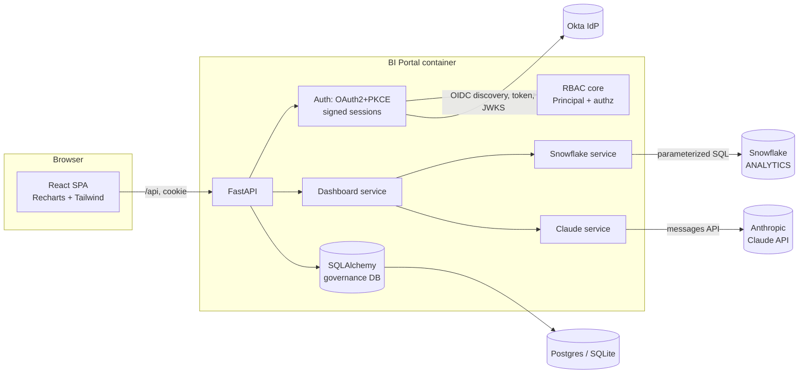
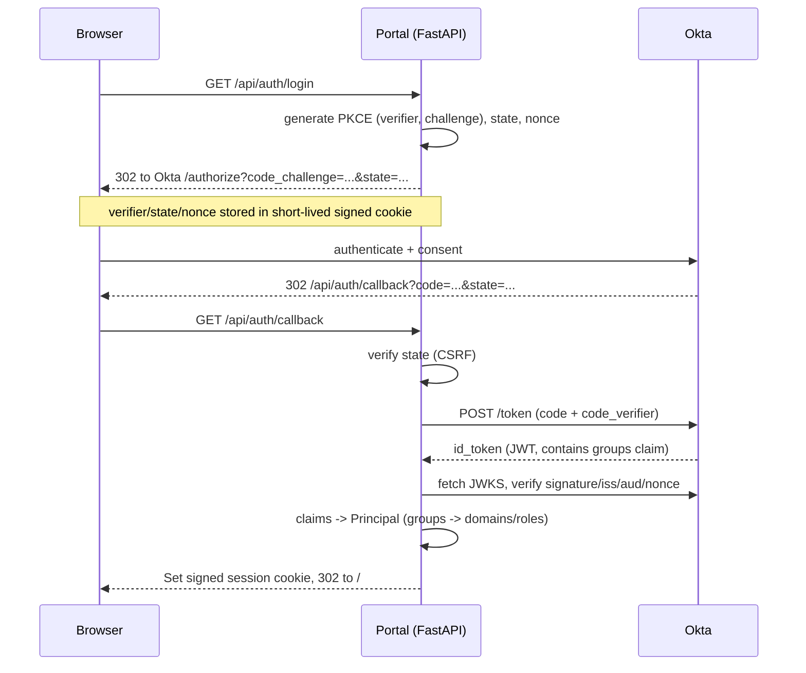
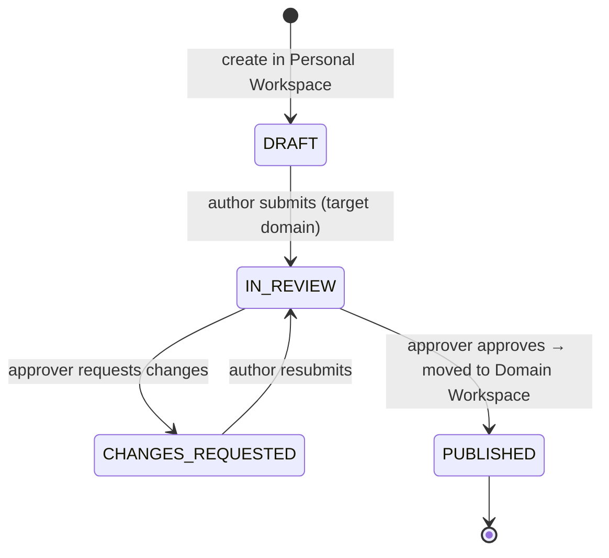
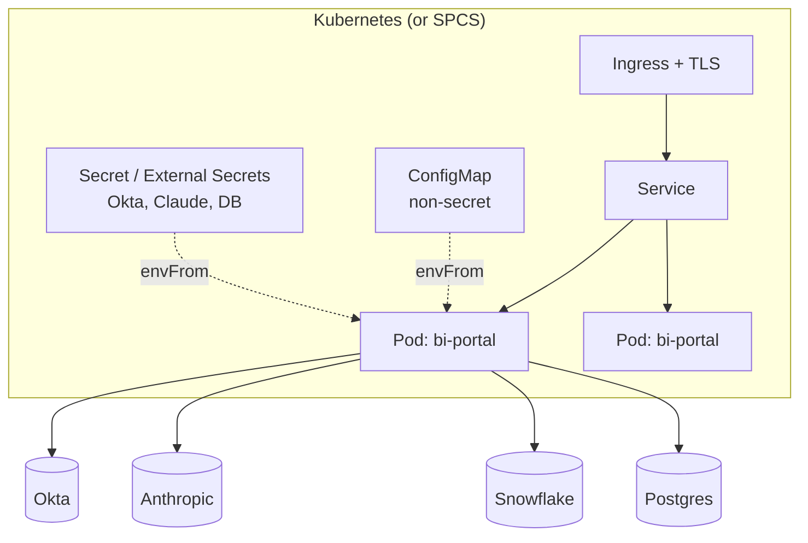

# Architecture

This document explains **why** the system is structured the way it is. For how
to run it, see the [README](../README.md).

## 1. Design principles

1. **Authorization is a first-class, centralized concern.** All "who can do
   what" logic lives in `auth/rbac.py` (identity → permissions) and
   `services/authz.py` (resource checks). Routers never inspect raw Okta group
   strings. This makes the security model auditable and unit-testable in
   isolation.
2. **Deny by default, fail closed.** Unauthenticated → 401. Unauthorized access
   to a *domain* resource → **404** (we don't even confirm it exists), so other
   functions' dashboards can't be enumerated by guessing IDs.
3. **Pluggable externals with identical code paths.** Okta, Claude, and
   Snowflake each have a real implementation and a graceful fallback (mock auth,
   deterministic insight, synthetic data). Prod vs. demo differ only by env
   vars — so the thing you demo is the thing you ship.
4. **Stateless app tier.** Sessions are signed cookies; portal state is in a
   relational DB; analytical data stays in Snowflake. The container scales
   horizontally with no sticky sessions.
5. **Single artifact.** One Docker image serves the API and the SPA, removing a
   class of CORS/deploy-skew problems.

## 2. Component view



## 3. OAuth 2.0 Authorization Code + PKCE sequence



Why PKCE: binds the token exchange to the browser that began the flow, so an
intercepted `code` is useless. `state` stops CSRF on the redirect; `nonce` binds
the `id_token` to this attempt (replay protection). See `auth/okta.py`.

## 4. Data model (governance metadata)

Analytical data lives in Snowflake and is never copied here. This store holds
only *governance* state.

```mermaid
erDiagram
  USER ||--o{ FOLDER : "owns (personal)"
  USER ||--o{ REPORT : authors
  FOLDER ||--o{ REPORT : contains
  REPORT ||--o{ APPROVAL_REQUEST : has

  USER { int id PK; string okta_sub UK; string email; string name }
  FOLDER { int id PK; string slug UK; enum type "shared|domain|personal"; string domain; int owner_user_id FK }
  REPORT { int id PK; enum dashboard_type; enum status; int folder_id FK; int owner_user_id FK; string target_domain; json config }
  APPROVAL_REQUEST { int id PK; int report_id FK; string target_domain; enum decision; int reviewer_id }
  AUDIT_EVENT { int id PK; string user_email; string action; bool allowed }
```

Key modeling choices:
- **Folders are the unit of access control** (not individual ACLs per report),
  which keeps the permission model small and predictable.
- **`Report.target_domain`** is separate from `folder_id`: a report's *intended*
  domain is fixed at creation, while its *location* moves (personal → domain)
  on publish. This makes the publish operation a simple, auditable folder move.
- **`ApprovalRequest` is an explicit table**, not a boolean — every publish
  attempt and decision is recorded with reviewer + timestamp.

## 5. Publishing workflow (state machine)



Enforcement points (all in `services/authz.py`):
- `assert_can_request_publish` — only the author, only into a domain they belong
  to, only from DRAFT/CHANGES_REQUESTED.
- `assert_can_decide_publish` — only an **approver** for the target domain.

## 6. Request enforcement pipeline

Every protected request passes the same gauntlet:

```
HTTP request
  → get_current_principal()      # 401 if no/invalid session
  → get_current_user()           # resolve DB user (JIT provisioned)
  → authz.* check on the resource # 404/403 if not entitled
  → query scoping (visible_*)     # list endpoints can't over-return
  → handler runs
  → audit() security-relevant actions
```

Two layers (point checks **and** query scoping) give defense in depth: even a
buggy handler that forgets a check still can't leak rows, because the base query
is already filtered.

## 7. Deployment topology



- Replicas ≥ 2 (stateless). Probes hit `/api/health`.
- Pods run non-root, read-only root filesystem, dropped capabilities.
- Config split: non-secrets in ConfigMap, secrets via Secret/External Secrets
  (K8s) or native SECRET objects (SPCS). Rotation = rollout, not a rebuild.

## 8. Technology choices & trade-offs

| Choice | Why | Trade-off / alternative |
|---|---|---|
| FastAPI | DI model maps cleanly to layered auth; async I/O for Claude/Snowflake; OpenAPI for free | Could use Django for batteries-included admin |
| Signed-cookie sessions | Stateless, simple, scalable | No server-side revocation; for that, add Redis session store (see FUTURE_WORK) |
| SQLite default / Postgres prod | Zero-config demo, drop-in prod via `DATABASE_URL` | Need Alembic migrations before real prod |
| Folder-level RBAC | Small, predictable, matches the brief | Per-report sharing needs an ACL table later |
| React SPA served by API | One artifact, one origin, no prod CORS | SSR/SEO not needed for an internal portal |
| Synthetic-data fallback | Fully demoable offline; same shape as real SQL | Real Snowflake SQL is reference-only until creds exist |
